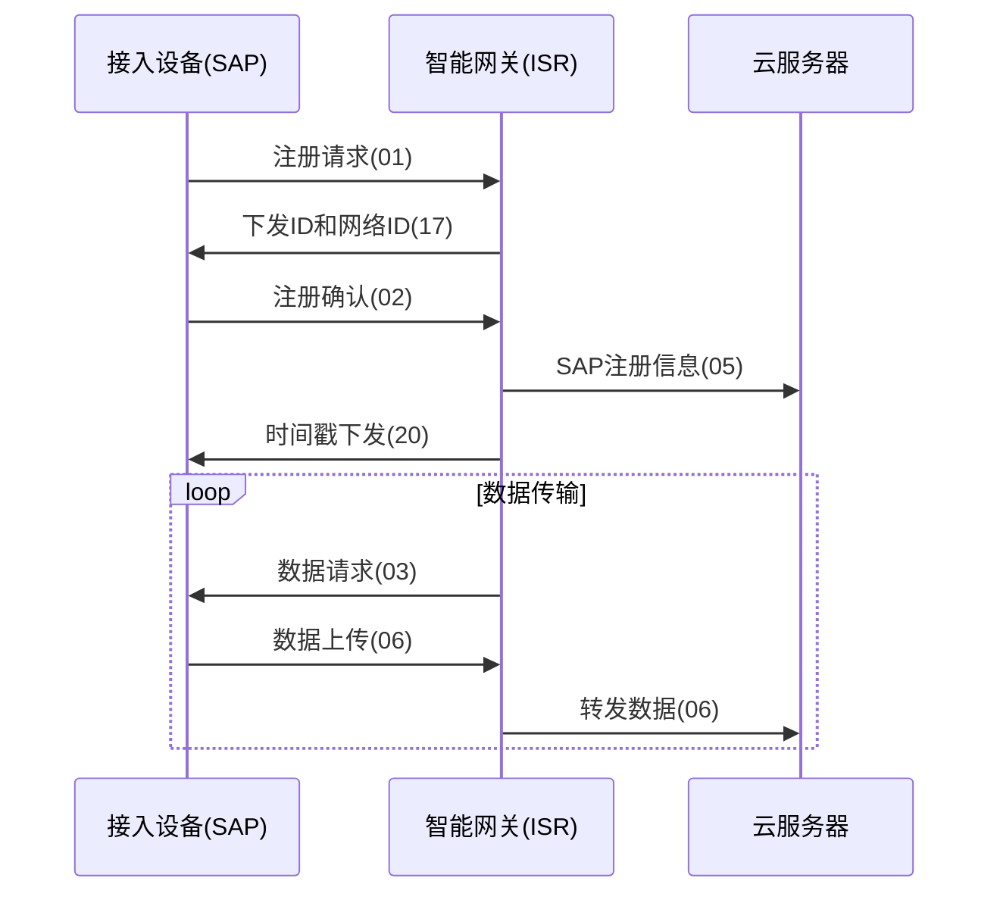

# TRLIB 智能网关系统

## 项目概述

TRLIB（Transmission and Routing Library）是一个用于物联网场景的智能网关系统，提供多接口通信、协议转换和智能网络选择功能。系统作为SAP（接入设备）和服务器之间的桥梁，管理设备连接、处理通信协议、转发数据，并提供离线缓存能力。

核心功能包括：
- 多通信接口管理（WiFi、LoRa、蓝牙、4G、有线网络）
- 私有协议实现与转换
- 智能网络选择
- 断线重连与离线数据缓存
- 事件驱动的异步处理架构

## 系统架构

```
┌─────────────────────────────────────────────────────────────────┐
│                        TRLIB智能网关系统                          │
├─────────────┬───────────────┬────────────────┬─────────────────┤
│             │               │                │                 │
│ 设备管理模块  │  通信选择模块   │   协议处理模块   │   服务器连接模块  │
│ (Device)    │(CommSelector) │ (ISRConnection)│   (TRServer)    │
│             │               │                │                 │
├─────────────┴───────────────┴────────────────┴─────────────────┤
│                                                                 │
│                         基础设施层                               │
│         (EventScheduler, ThreadPool, Poller, Timer等)           │
│                                                                 │
├─────────────┬───────────────┬────────────────┬─────────────────┤
│   WiFi接口   │   LoRa接口     │   蓝牙接口      │   4G/有线接口    │
└─────────────┴───────────────┴────────────────┴─────────────────┘
```

## 技术栈

- **编程语言**：C++11/14
- **网络编程**：Socket API、Epoll/Select多路复用
- **并发处理**：线程池、单Reactor事件处理架构
- **设计模式**：工厂模式、观察者模式
- **硬件接口**：串口通信、网络接口管理

## 核心组件

### 基础设施层

- **EventScheduler**: 事件调度器，管理IO事件和定时事件
- **Poller**: IO多路复用封装，支持Epoll和Select两种实现
- **Timer**: 定时器管理，支持一次性和周期性任务
- **ThreadPool**: 线程池，处理异步任务
- **Event**: 事件基类，包括IO事件、触发事件和定时器事件

### 设备与通信模块

- **Device**: 管理物理设备接口（WiFi、LoRa、蓝牙、LAN等）
- **CommunicationSelector**: 智能通信选择器，根据需求选择最佳通信方式
- **ISRConnection**: 处理与设备的连接
- **TRServer**: 管理与云服务器的连接
- **Buffer**: 缓冲区实现，用于数据传输

## 私有协议实现

TRLIB实现了一套自定义私有协议，用于ISR（网关）、SAP（接入设备）和服务器之间的通信。协议基本结构如下：

```
┌───────┬───────┬───────┬───────┬───────┬───────┬───────┬───────┬───────┐
│ 起始  │ 协议  │ 通信  │ 源ID  │ 网络ID │ 协议  │ 分包  │ 数据  │ 结束  │
│ 标识  │ 序号  │ 模块  │       │       │ 类型  │ 标识  │ 长度  │ 标识  │
├───────┼───────┼───────┼───────┼───────┼───────┼───────┼───────┼───────┤
│   $   │  2B   │  1B   │  2B   │  4B   │  1B   │  2B   │  4B   │   @   │
└───────┴───────┴───────┴───────┴───────┴───────┴───────┴───────┴───────┘
```

### 主要消息类型

- **01**: SAP注册请求
- **02**: SAP注册确认
- **03**: ISR数据请求
- **04**: ISR注册
- **05**: SAP注册（ISR转发）
- **06**: 数据上传
- **17**: 网关数据下发（ID、网络ID等）
- **20**: 时间戳下发
- **22**: ISR心跳包

## 通信流程

下面是系统典型通信流程：



## 特色功能

### 智能通信选择

`CommunicationSelector`模块实现了一个智能通信接口选择器，根据通信需求（可靠性、吞吐量、延迟等）动态选择最合适的通信接口：

```cpp
// 通信接口评分算法（简化版）
double score = (w₁ × Reliability + w₂ × Throughput + w₃ × Latency + 
               w₄ × Power + w₅ × DeviceTypeCompatibility) / 
               (w₁ + w₂ + w₃ + w₄ + w₅)
```

### 离线数据缓存

当网络连接不可用时，系统会自动将数据缓存到本地文件系统：

```cpp
// 保存离线数据
std::cout << "save offline mess, mess = " << mess << std::endl;
int fd = open(mOffLinePath.c_str(), O_WRONLY | O_CREAT | O_APPEND, 0777);
mess += "\r\n";
int ret = write(fd, mess.c_str(), strlen(mess.c_str()));
```

当网络重新连接时，系统自动将缓存数据发送到服务器。

### 事件驱动架构

TRLIB使用事件驱动架构处理异步IO和定时任务：

```cpp
// 事件调度器循环
void EventScheduler::loop() {
    while (true)
    {
        handleTriggerEvent();
        mPoller->handleEvent();
    }
}
```

## 构建与运行

### 依赖项

- C++11或更高版本的编译器
- Linux操作系统（支持epoll）
- pthread库

### 使用CMake构建

```bash
# 创建构建目录
mkdir -p build && cd build

# 配置项目
cmake ..

# 编译项目
cmake --build .

# 运行网关程序
./bin/ISR
```

### 使用Make构建（传统方式）

```bash
# 直接使用make构建
make

# 运行网关程序
./ISR
```

## 设备连接

系统支持以下物理接口：

- **WiFi**: 通过hostapd创建AP模式接入点
- **LoRa**: 通过串口与LoRa模块通信
- **蓝牙**: 通过串口与蓝牙模块通信
- **有线网络**: 通过Ethernet接口连接
- **4G**: 通过PPP拨号连接互联网

## 异常处理

系统实现了多种异常处理机制：

- 断线重连
- 心跳检测
- 超时重传
- 设备状态监控

## 适用场景

TRLIB适用于以下场景：

- **环境监测系统**: 大气、水质、土壤等环境参数监测
- **智能工业物联网**: 工业设备连接与监控
- **智慧农业**: 农田监测、灌溉控制系统
- **分布式传感网络**: 大规模传感器数据采集

## 系统配置

系统可以通过修改以下参数进行配置：

- 服务器地址: InetAddress类中的serverAddr和aliyunAddr
- 本地网络参数: isrWifiAddr和isrLanAddr
- 网络接口: /dev/tong_lora, /dev/tong_wifi等设备路径


## 接口文档

### 主要类及接口

#### EventScheduler

事件调度器，管理各类事件：

```cpp
class EventScheduler {
public:
    static EventScheduler* createNew(PollerType type);
    bool addIOEvent(IOEvent* event);
    bool updateIOEvent(IOEvent* event);
    bool removeIOEvent(IOEvent* event);
    void loop();
    bool addTriggerEvent(TriggerEvent* event);
    Timer::TimerId addTimerEventRunEvery(TimerEvent* event, Timer::TimeInterval interval);
};
```

#### ISRServer

ISR服务器，管理SAP连接和协议处理：

```cpp
class ISRServer {
public:
    static std::unique_ptr<ISRServer> createNew(EventScheduler *scheduler, 
        ThreadPool *threadPool, InetAddress &wifiAddr, 
        InetAddress &lanAddr, std::vector<InetAddress> serverAddrs);
    void start();
    void handle01Mess(void *arg, std::string sapMac);  // SAP注册请求
    void handle02Mess(void *arg, std::string sapMac);  // SAP注册确认
    // ... 其他消息处理函数
};
```

#### LocalCommSelector

智能通信选择器：

```cpp
class LocalCommSelector {
public:
    static LocalCommSelector* createNew(EventScheduler* scheduler);
    void registerInterface(LocalCommType type, int fd);
    void unregisterInterface(LocalCommType type);
    LocalCommType selectBestInterface(const LocalCommRequirements& requirements, 
                                      const std::string& targetDeviceId = "");
};
```

## 代码示例

### 主程序初始化

```cpp
int main()
{
    EventScheduler *scheduler = EventScheduler::createNew(EventScheduler::POLLER_EPOLL);
    ThreadPool *threadPool = ThreadPool::createNew(1);
    std::vector<InetAddress> serverAddrs = {aliyunAddr};
    std::unique_ptr<ISRServer> isrServer = ISRServer::createNew(scheduler, threadPool, 
                                           isrWifiAddr, isrLanAddr, serverAddrs);
    isrServer->start();
    scheduler->loop(); // 处理事件
    return 0;
}
```

### 设备初始化

```cpp
Device::Device(InetAddress &wifiAddress, InetAddress &lanAddress) : 
    mWifiAddress(wifiAddress),
    mLanAddress(lanAddress)
{
    mLoraFd = openLora();
    mWifiFd = openWifi();
    mBlueToothFd = openBlueTooth();
    mLanFd = openLan();
    // ...
}
```

### 消息处理示例

```cpp
void ISRServer::handle01Mess(void *arg, std::string sapMac)
{
    if (mSAPMacMap.find(sapMac) != mSAPMacMap.end()) {
        std::cout << sapMac << " registered, send 20 mess" << std::endl;
        handle20Mess(arg, sapMac);
    } else {
        mSAPMacMap.insert(std::make_pair(sapMac, (ISRConnection *)arg));
        std::cout << sapMac << " register, send 17 mess" << std::endl;
        handle17Mess(arg, sapMac);
    }
}
```